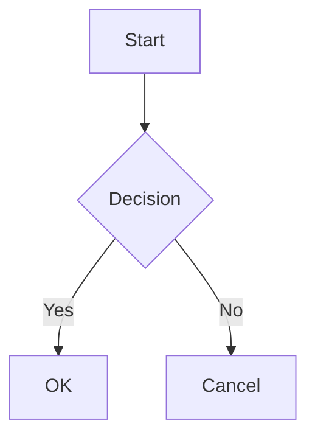
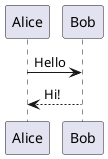

# File Viewer

A local HTTP server that renders Markdown, JSON, YAML, TOML, and CSV files with a modern web interface. Designed for iTerm2's browser pane integration.


## Features

### File Formats
- **Markdown** - Full rendering with Table of Contents, syntax highlighting, math formulas (KaTeX), and diagrams
- **JSON** - Interactive tree view with expand/collapse and search
- **YAML** - Syntax highlighted with copy button
- **TOML** - Syntax highlighted with copy button
- **CSV** - Interactive table with filtering
- **HTML** - Raw passthrough
- **Text** - Preformatted with search

### Diagrams
- **Mermaid** - Flowcharts, sequence diagrams, class diagrams, etc.
- **PlantUML** - UML diagrams via PlantUML server

### Interface
- **Sidebar** - File explorer with navigation
- **Favorites** - Bookmark files and folders (persisted in localStorage)
- **Recent Files** - Track recently viewed files
- **Split Panels** - Up to 4 independent navigation panels with drag-to-resize
- **6 Themes** - Light, Dark, Sepia, Nord, Solarized Light, Solarized Dark
- **Link Preview** - Hover over internal links to preview content
- **Export PDF** - Print-optimized styles for PDF export
- **Live Reload** - Auto-refresh when files change

### Performance
- **CDN Caching** - Local cache for Prism.js, KaTeX, and Mermaid dependencies

## Installation

### From Source

```bash
# Clone the repository
git clone https://github.com/feraudet/file-viewer.git
cd file-viewer

# Build
go build -o file-viewer

# Run
./file-viewer
```

### As a Service (macOS)

Create `~/Library/LaunchAgents/com.yourname.file-viewer.plist`:

```xml
<?xml version="1.0" encoding="UTF-8"?>
<!DOCTYPE plist PUBLIC "-//Apple//DTD PLIST 1.0//EN" "http://www.apple.com/DTDs/PropertyList-1.0.dtd">
<plist version="1.0">
<dict>
    <key>Label</key>
    <string>com.yourname.file-viewer</string>
    <key>ProgramArguments</key>
    <array>
        <string>/path/to/file-viewer</string>
    </array>
    <key>RunAtLoad</key>
    <true/>
    <key>KeepAlive</key>
    <true/>
</dict>
</plist>
```

Then load it:
```bash
launchctl load ~/Library/LaunchAgents/com.yourname.file-viewer.plist
```

## Usage

The server runs on `http://localhost:4120` by default.

### View a file
```
http://localhost:4120/path/to/file.md
```

### API Endpoints

| Endpoint | Description |
|----------|-------------|
| `GET /{filepath}` | Render a file |
| `GET /files?dir={path}` | List directory contents (JSON) |
| `GET /mtime/{filepath}` | Get file modification time |
| `GET /preview/{filepath}` | Get rendered content only (for link preview) |
| `GET /asset?path={path}` | Serve static assets (images, PDFs) |
| `GET /cdn/{host}/{path}` | Proxy and cache CDN resources |

### iTerm2 Integration

Add a script to open files in iTerm2's browser pane:

```bash
#!/bin/bash
# ~/bin/open-in-iterm-browser
open -a iTerm "http://localhost:4120$1"
```

Then Cmd+click on file paths in your terminal to view them.

## Markdown Features

### Syntax Highlighting

````markdown
```python
def hello():
    print("Hello, World!")
```
````

Supported languages: Python, JavaScript, TypeScript, Go, Rust, Java, C, C++, Bash, SQL, CSS, YAML, TOML, JSON, and more.

### Math (KaTeX)

Inline: `$E = mc^2$`

Block:
```
$$
\int_{-\infty}^{\infty} e^{-x^2} dx = \sqrt{\pi}
$$
```

### Mermaid Diagrams

````markdown

````

### PlantUML Diagrams

````markdown

````

### Footnotes

```markdown
Here is a sentence with a footnote[^1].

[^1]: This is the footnote content.
```

### Other Features
- Tables with alignment
- Task lists `- [x] Done`
- Blockquotes
- Horizontal rules
- Images with lightbox
- Emoji `:smile:` → 😊
- Highlight `==text==`
- Strikethrough `~~text~~`

## Screenshots

### Light Theme
The default clean interface with syntax highlighting and TOC.

### Dark Theme
Easy on the eyes for late-night coding sessions.

### Split Panels
Navigate multiple directories simultaneously.

## Configuration

The server uses sensible defaults:
- **Port**: 4120
- **Max file size**: 5MB (larger files are not rendered)
- **CDN cache**: `~/.cache/file-viewer/cdn/`

## API Documentation

See [API.md](API.md) for complete API documentation.

## License

MIT License - See [LICENSE](LICENSE) for details.

## Contributing

Contributions are welcome! Please feel free to submit a Pull Request.
